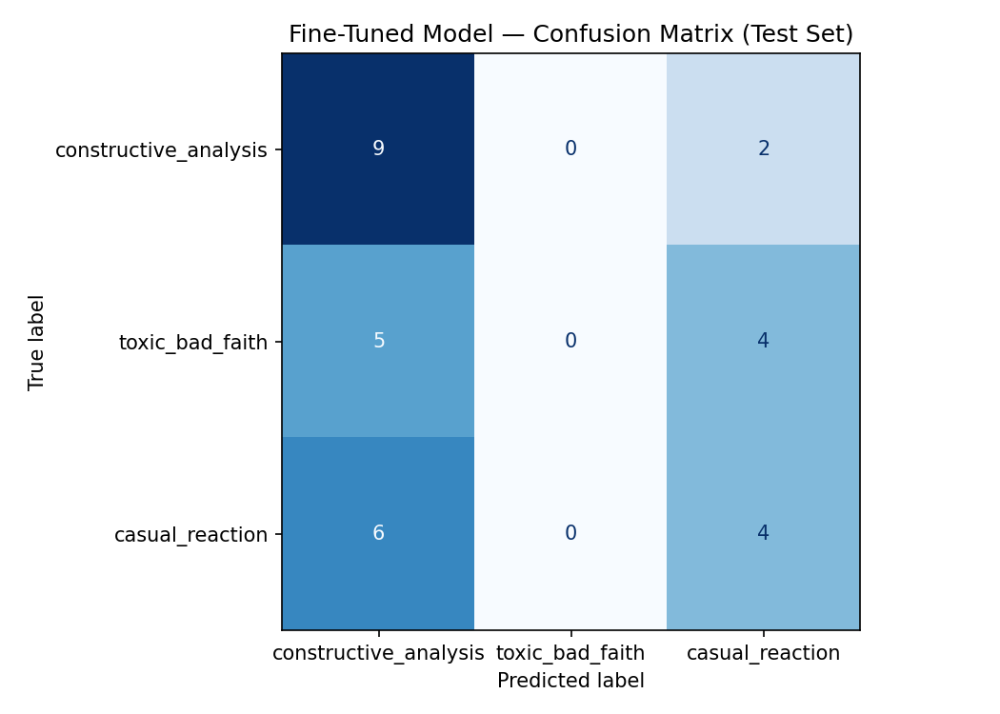

# r/NYKnicks Discourse Quality Classifier

This project builds a fine-tuned text classifier to evaluate discourse quality in **r/NYKnicks**, a Reddit community focused on discussion of the New York Knicks. The goal is to classify comments into categories that distinguish thoughtful basketball discussion from casual fan reactions and toxic or bad-faith discourse.

## Community

I chose **r/NYKnicks** because NBA team subreddits contain a wide range of discourse styles. Some comments include detailed basketball analysis about players, coaching, trades, rotations, and game strategy. Other comments are short fan reactions, jokes, memes, or emotional responses. Some comments can also become hostile or insulting, especially after losses or controversial games. This variety makes r/NYKnicks a good fit for a discourse-quality classification task.

## Labels

The dataset uses three labels:

| Label | Definition |
|---|---|
| `constructive_analysis` | Comments that add meaningful basketball discussion, reasoning, statistics, strategy, roster analysis, or thoughtful opinion. |
| `casual_reaction` | Comments that are mostly jokes, memes, hype, complaints, emotional reactions, or short unsupported opinions, but are not directly harmful. |
| `toxic_bad_faith` | Comments that lower discussion quality through insults, trolling, baiting, harassment, or hostile language. |

## Dataset

The dataset contains at least **200 Reddit comments** collected from public r/NYKnicks threads. I focused on comments rather than posts because comments provide more direct examples of community discourse.

Examples were collected from thread types such as:

- Game threads
- Post-game threads
- Trade or free-agency discussions
- Injury news threads
- Player performance discussions
- Daily or general discussion threads

Deleted and removed comments were excluded. Very short comments were excluded unless they were clearly meaningful fan reactions.

## Labeling Process

Each comment was manually labeled based on its main purpose and effect on discussion quality. If a comment gave meaningful basketball reasoning, it was labeled `constructive_analysis`. If it was mostly a joke, meme, hype comment, or emotional response without direct hostility, it was labeled `casual_reaction`. If it contained direct insults, harassment, trolling, or hostile baiting, it was labeled `toxic_bad_faith`.

For ambiguous examples, I prioritized the label that best represented the comment's effect on the conversation. A negative comment could still be constructive if it explained its reasoning. A comment with basketball reasoning could still be toxic if it directly insulted another user or group.

## Data Split

The final dataset is split into train, validation, and test sets.

| Split | Count |
|---|---:|
| Train | 140 |
| Validation | 30 |
| Test | 30 |
| Total | 200 |

## Label Distribution

Update this table after annotation is complete.

| Label | Count |
|---|---:|
| `constructive_analysis` | TODO |
| `casual_reaction` | TODO |
| `toxic_bad_faith` | TODO |
| Total | 200 |

## Difficult Labeling Examples

Update these after annotation is complete.

1. **Strong criticism with reasoning**: Some comments strongly criticize a player or coach but also explain a basketball reason. I label these as `constructive_analysis` if the main purpose is analytical rather than insulting.

2. **Sarcastic fan reaction**: Some comments are negative or sarcastic but not directly abusive. I label these as `casual_reaction` if they are mostly emotional or meme-like.

3. **Analysis plus insult**: Some comments include basketball reasoning but also directly insult another user or fanbase. I label these as `toxic_bad_faith` because the hostile framing reduces discourse quality.

## Evaluation

I evaluate the classifier using accuracy, per-label precision, per-label recall, macro F1 score, and a confusion matrix. Accuracy alone is not enough because the labels may be imbalanced. Macro F1 is important because it gives equal weight to each label, while precision and recall help show whether the model is unfairly over-labeling comments as toxic or missing harmful comments.

## Results

The fine-tuned model is `distilbert-base-uncased`, evaluated on the held-out test set of **30 comments**.

| Metric | Value |
|---|---:|
| Baseline accuracy | 53.33% |
| Fine-tuned accuracy | 30.00% |
| Improvement over baseline | −23.33% |

The fine-tuned model **underperformed** the baseline. Rather than learning to separate the three classes, it collapsed toward predicting `constructive_analysis` for most comments and **never predicted `toxic_bad_faith` at all**. With only 140 training examples across three classes, the model likely lacked enough signal to learn the more nuanced and minority categories.

### Confusion Matrix

Rows are the true labels and columns are the predicted labels:

| True \ Predicted | constructive_analysis | toxic_bad_faith | casual_reaction |
|---|---:|---:|---:|
| **constructive_analysis** | 9 | 0 | 2 |
| **toxic_bad_faith** | 5 | 0 | 4 |
| **casual_reaction** | 6 | 0 | 4 |

Key observations:

- The model correctly classified most `constructive_analysis` comments (9 of 11).
- It **failed completely on `toxic_bad_faith`**, predicting that class zero times and misclassifying all toxic comments as either constructive or casual. This is the most concerning failure for a moderation use case, since it misses harmful comments.
- `casual_reaction` comments were frequently confused with `constructive_analysis` (6 of 10).

### Did it meet the definition of success?

No. The target was around **75% accuracy**, **0.70 macro F1**, and reasonable precision/recall on `toxic_bad_faith`. The fine-tuned model reached only 30% accuracy and had zero recall on `toxic_bad_faith`, so it does not meet the bar for a useful classifier. Likely next steps would be collecting more labeled data (especially for the minority classes), addressing class imbalance (e.g., class weighting or oversampling), and tuning training hyperparameters.

## Definition of Success

For this class project, I would consider the classifier useful if it reaches around **75% accuracy**, **0.70 macro F1**, and reasonable precision and recall for the `toxic_bad_faith` label. For a real community moderation tool, I would expect stronger performance and would use the model only as a human-review assistant, not as an automatic deletion system.

## Video link 
https://drive.google.com/file/d/1_w-8K2xbqojV9ziHhj8pNINU1UGtexmR/view?usp=sharing